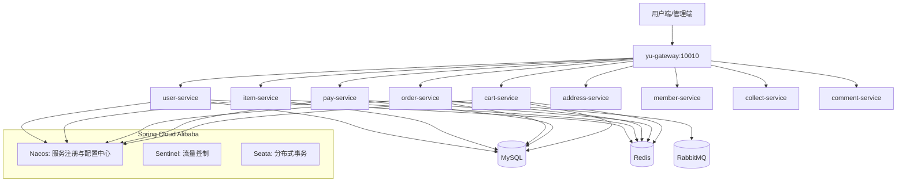

# YU-MALL 鱼的电商系统


## 项目简介

基于 Spring Cloud Alibaba + Vue 3 的微服务全栈电商系统，包含用户、商品、订单、支付、购物车等核心模块。

## 目录

- [核心特性](#核心特性)
- [架构](#架构)
- [技术栈](#技术栈)
- [环境预要求](#环境预要求)
- [安装与运行](#安装与运行)
- [项目结构](#项目结构)
- [版本兼容性](#版本兼容性)
- [贡献指南](#贡献指南)
- [许可证](#许可证)

## 核心特性

- 用户认证与授权
- 商品浏览与搜索
- 购物车管理
- 订单创建与支付
- 会员中心
- 收藏与评论

## 架构



## 技术栈

| 层级 | 技术 |
|------|------|
| 后端框架 | Spring Boot 2.7.12, Spring Cloud 2021.0.3, Spring Cloud Alibaba 2021.0.4.0 |
| ORM | MyBatis-Plus 3.5.3.1 |
| 数据库 | MySQL 8.0.23, Druid 连接池 |
| 缓存 | Redis + Caffeine |
| 消息队列 | RabbitMQ |
| 注册/配置中心 | Nacos |
| 分布式事务 | Seata |
| API文档 | Knife4j 3.0.3 |
| 工具类 | Hutool 5.8.11, Lombok 1.18.24, EasyExcel 3.3.2 |
| 前端框架 | Vue 3.2.38 + TypeScript 5.x + Vite 3.x |
| UI组件库 | Element Plus, Naive UI |
| 状态管理 | Pinia |
| 样式 | SCSS + Tailwind CSS |

## 环境预要求

- JDK 11
- Maven 3.6+
- Node.js 16+
- MySQL 8.0+
- Redis 6.0+
- RabbitMQ 3.8+
- Nacos 2.x

## 安装与运行

### 构建顺序

**重要：必须先安装公共模块**

```bash
# 1. 安装公共模块（必须先执行）
mvn clean install -pl yu-common,yu-api -DskipTests

# 2. 构建所有模块
mvn clean package -DskipTests
```

### 启动服务

```bash
# 后端服务（按顺序启动）
# 1. Nacos (默认 192.168.100.128:8848)
# 2. yu-gateway
# 3. user-service, item-service, order-service 等

# 前端 - 用户端
cd frontend && npm install && npm run dev
# 访问 http://localhost:4173

# 前端 - 管理端
cd frontend-admin && npm install && npm run dev
# 访问 http://localhost:4174
```

### API文档

各服务启动后访问 Knife4j 文档：

```
http://localhost:{端口}/doc.html
```

## 项目结构

```
yu-mall/
├── yu-common/          # 公共模块：工具类、异常、通用响应
├── yu-api/             # Feign客户端、DTO、VO（服务间通信）
├── yu-gateway/         # API网关
├── user-service/       # 用户服务
├── item-service/       # 商品服务
├── order-service/      # 订单服务
├── pay-service/        # 支付服务
├── cart-service/       # 购物车服务
├── address-service/    # 地址服务
├── member-service/     # 会员服务
├── collect-service/    # 收藏服务
├── comment-service/    # 评论服务
├── frontend/           # 用户端前端 (Vue 3)
└── frontend-admin/     # 管理端前端 (Vue 3)
```

## 版本兼容性

| Spring Boot | Spring Cloud | Spring Cloud Alibaba |
|-------------|--------------|---------------------|
| 2.7.12 | 2021.0.3 | 2021.0.4.0 |

## 贡献指南

1. Fork 本仓库
2. 创建特性分支 (`git checkout -b feature/AmazingFeature`)
3. 提交更改 (`git commit -m 'module: description'`)
4. 推送到分支 (`git push origin feature/AmazingFeature`)
5. 创建 Pull Request

**提交信息格式**：`<module>: <description>`

示例：
- `item-service: add SKU stock validation`
- `order-service: fix timeout consumer retry`
- `frontend: update item detail page layout`

## 许可证

本项目采用 GPL 协议开源。
